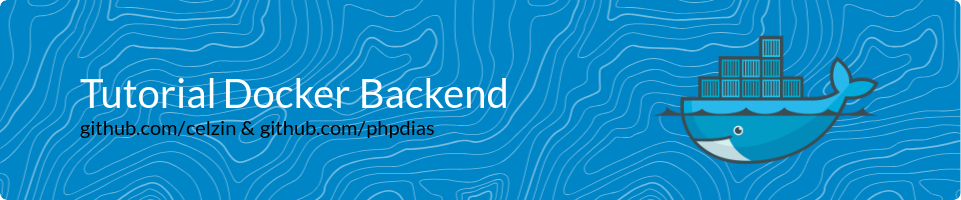

<div align="center" style="display: inline_block">
  
  
  
  
</div>

<br>
<h1 align="center">
    <a>
        
    </a>
</h1>

Siga as seguintes etapas para criar um container que execute o backend disponível neste repositório Git.

# Passo 1: Instalação do Docker

Certifique-se de que tenha o Docker instalado. Você pode fazer o download e instalar o Docker a partir do [site oficial](https://docs.docker.com/get-docker/).

# Passo 2: Clonando o Repositório Git

Primeiro, clone o repositório Git que contém o código do backend. Utilize o seguinte comando no terminal:

```bash
git clone https://github.com/celzin/Tutorial-Docker-Backend
```

Isso irá criar um diretório chamado `Tutorial-Docker-Backend` com o código-fonte do backend.

# Passo 3: Criando um Dockerfile

Dentro do diretório `Tutorial-Docker-Backend`, existe um arquivo `Dockerfile` para definir como o container Docker será construído. Aqui está o `Dockerfile` utilizado nesse repositório para um aplicativo Node.js:

```Dockerfile
FROM node:alpine
#RUN mkdir -p /home/ubuntu/backLaboratorioSO/node_modules && chown -R node:node /home/ubuntu/backLaboratorioSO
WORKDIR /usr/app
# RM package.json *.* ./
COPY package.json *.* ./
RUN npm install
COPY . .
EXPOSE 3000
CMD npm start
```

# Passo 4: Construindo a Imagem Docker

No diretório onde está criado o `Dockerfile`, use o seguinte comando para construir a imagem Docker:

```bash
docker build -t meu-backend:1.0 .
```

Isso irá construir a imagem com o nome `meu-backend` e a tag `1.0`. Certifique-se de incluir o `.` no final do comando para indicar que o `Dockerfile` está no diretório atual.

# Passo 5: Executando o Container Docker

Agora, você pode executar um container com a imagem recém-criada:

```bash
docker run -d -p 3000:3000 --name meu-backend-container meu-backend:1.0
```

- `-d` executa o container em segundo plano.
- `-p 3000:3000` mapeia a porta 3000 do seu sistema para a porta 3000 dentro do container.
- `--name meu-backend-container` atribui um nome ao container.
- `meu-backend:1.0` é o nome da imagem que você deseja usar.

# Passo 6: Acessando o Backend

Agora, o seu backend deve estar em execução no container e acessível no seu sistema local na porta 3000. Pode acessá-lo através de um navegador da web ou usando ferramentas de teste de API.

Certifique-se de que todas as dependências e configurações necessárias para o seu aplicativo estejam corretamente configuradas no código do backend e no Dockerfile.

Este tutorial é um guia básico para criar um container Docker para um backend.